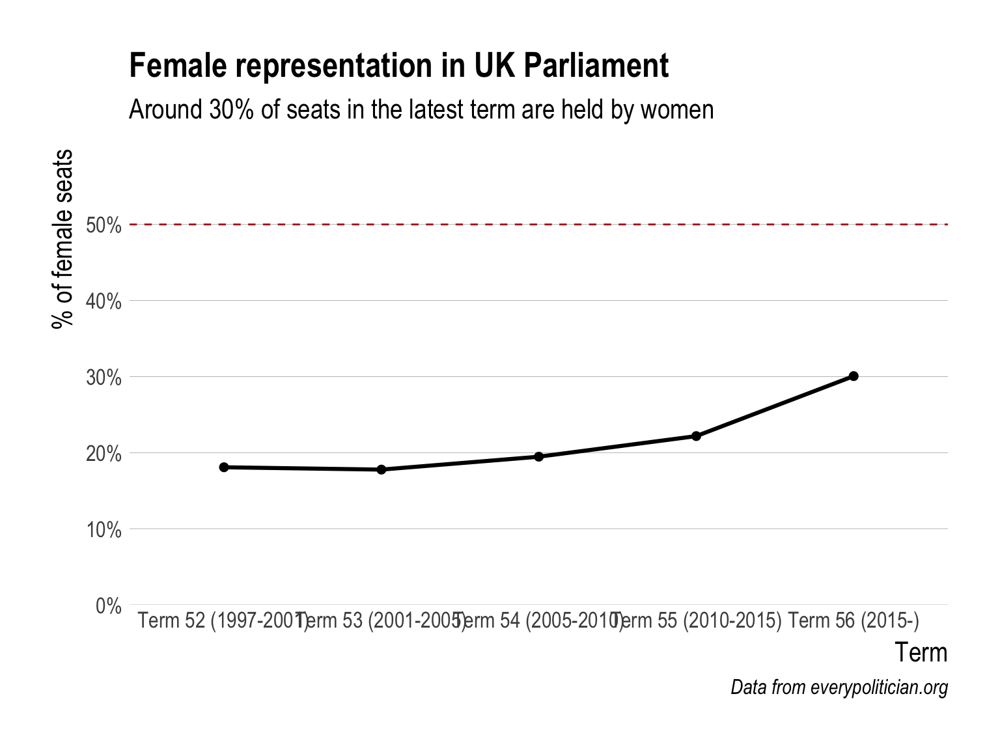
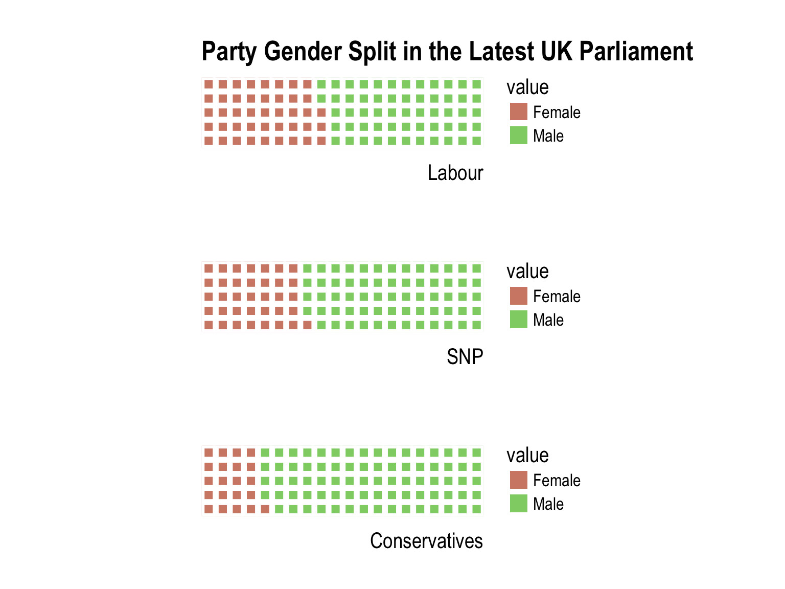
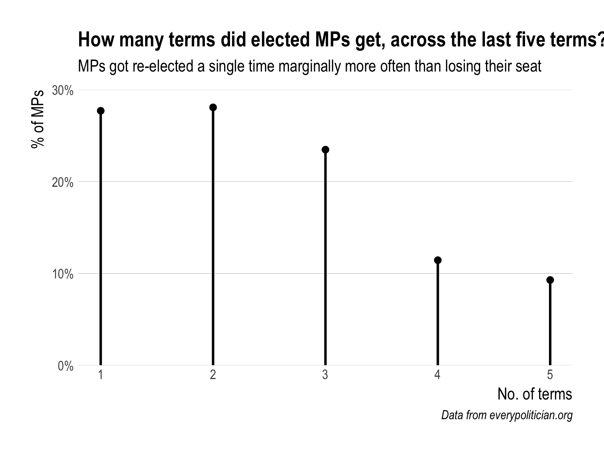
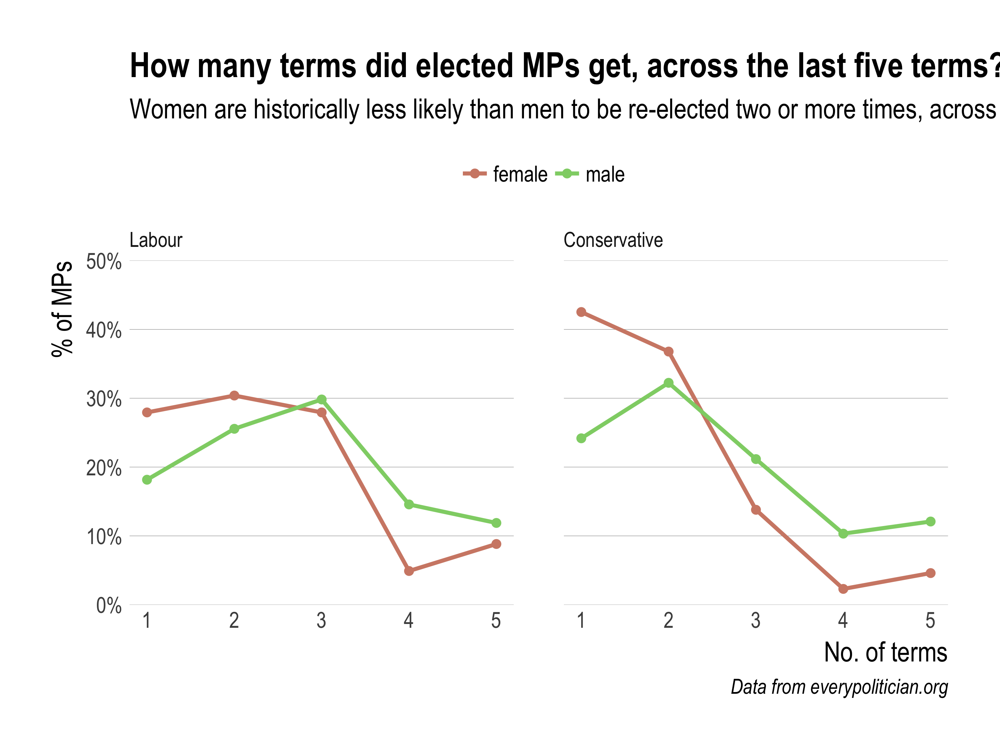
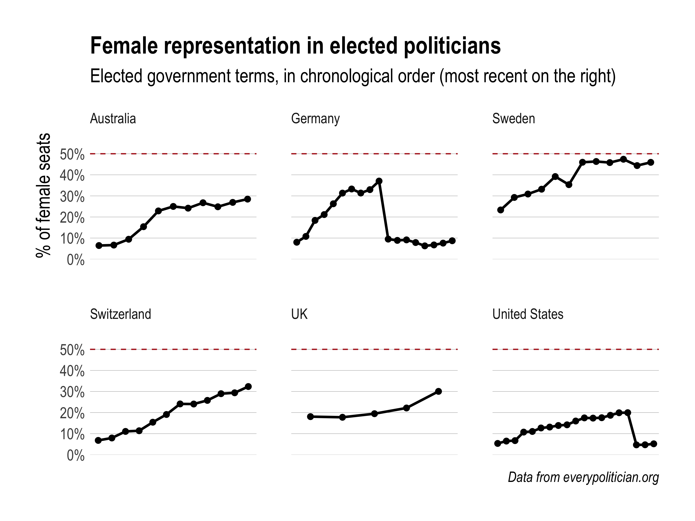

As a general election looms, a familiar UK media maelstrom has begun. The key difference here is that the public has been taken by surprise, somewhat - Theresa May's call for a snap election (we weren't actually due one until 2020) has left folk with little under two months to decide where their vote will go. 

For some, this may be the first election they are able to participate in. For many, the traditional delivery of party politics might not have kept them engaged all that well since the last election. Unfortunately, there isn't too much time to get all cases like these as up to speed as we would like this time round. The good news is there are ambitious projects like [EveryPolitician](http://everypolitician.org/uk/) looking to make governments around the world more transparent - perhaps we can leverage the data inside to empower voters, in some small way, ahead of 8th June.[^fullcode]


<br>

## Inside EveryPolicitian

EveryPolitician's mission is simple: *"collect and share data about every politician in every country in the world, in a consistent, open format that anyone can use."* They don't provide an API to query, but we can download the whole lot (for the UK) in JSON format to work on:


```r
data <- fromJSON("https://cdn.rawgit.com/everypolitician/everypolitician-data/8382ff6bd31785d630950716ccb53eccfbe8485f/data/UK/Commons/ep-popolo-v1.0.json")

members <- as.data.frame(data$persons) %>%
  left_join(as.data.frame(data$memberships), by = c("id"="person_id")) %>%
  mutate(legislative_period_id=as_factor(legislative_period_id),
         birth_date=as.Date(birth_date),
         on_behalf_of_id=as_factor(on_behalf_of_id),
         on_behalf_of_id_recoded =fct_recode(on_behalf_of_id, "Conservative"="conservative",
                                             "DUP"="dup", "Labour"="labour", 
                                             "SNP"="scottish-national-party",
                                             "Lib Dem"="liberal-democrat", "UUP"="uup",
                                             "Plaid Cymru"="plaid-cymru",
                                             "Independent"="independent", 
                                             "Labour"="labourco-operative",
                                             "Sinn Fein"="sinn-fein", 
                                             "Deputy Speaker"="deputy-speaker", 
                                             "Speaker"="speaker", "Green"="green", "UKIP"="ukip",
                                             "SDLP"="social-democratic-and-labour-party",
                                             "Independent"="independent-conservative",
                                             "Independent"="independent-ulster-unionist",
                                             "Respect"="respect", "UKUP"="ukup",
                                             "Independent"="independent-labour",
                                             "Alliance"="alliance"),
         term_start=as.Date(fct_recode(legislative_period_id, "2015-05-08"="term/56",
                                       "2010-05-06"="term/55", "2005-05-05"="term/54",
                                       "2001-06-07"="term/53", "1997-05-01"="term/52")),
         legislative_period_id=fct_recode(legislative_period_id, "Term 56 (2015-)"="term/56",
                                          "Term 55 (2010-2015)"="term/55", 
                                          "Term 54 (2005-2010)"="term/54",
                                          "Term 53 (2001-2005)"="term/53", 
                                          "Term 52 (1997-2001)"="term/52"),
         age_at_term_start=as.numeric(floor(difftime(term_start, birth_date, units="days")/365))) %>%
  select(name, birth_date, gender, on_behalf_of_id_recoded, role, legislative_period_id,
         term_start, age_at_term_start, id)

glimpse(members)
```

```
## Observations: 3,374
## Variables: 9
## $ name                    <chr> "Ron Davies", "George Osborne", "Georg...
## $ birth_date              <date> 1946-08-06, 1971-05-23, 1971-05-23, 1...
## $ gender                  <chr> "male", "male", "male", "male", "male"...
## $ on_behalf_of_id_recoded <fctr> Labour, Conservative, Conservative, C...
## $ role                    <chr> "member", "member", "member", "member"...
## $ legislative_period_id   <fctr> Term 52 (1997-2001), Term 53 (2001-20...
## $ term_start              <date> 1997-05-01, 2001-06-07, 2005-05-05, 2...
## $ age_at_term_start       <dbl> 50, 30, 33, 38, 43, 53, 57, 61, 48, 52...
## $ id                      <chr> "007f7ffe-65df-4166-afad-f3c8934afd8d"...
```

We now have biographic and demographic data for all members of Parliament across the last five legislative periods, or terms. With this information, it may be possible to start demonstrating how representativeness manifests itself in Parliament.

<br>

## Gender Balance

Something which demands immediate attention (not just in this domain) is understanding member's proportional representation by gender. A big problem for many voters is finding members to identify with, given the historic barriers to women entering a male-dominated parliamentary system. How does female representation look over time?



There has been sustained improvements in gender balance since the mid-00s, however it's still some way short of equality.

Of course, the 30% representation we see in the current term is an aggregate of different political parties. What does this percentage look like by party?

*N.B. The below graphic only includes the three parties with the largest count of members in the latest Parliament. Each of the other parties had fewer than ten representatives.*



Labour, currently the second largest party by no. of MPs (238), has double the proportionate amount of female MPs in comparison with the biggest, the Conservatives (333). 

It must be remembered that these figures represent *elected* officials, and so possible gender biases may stem from voters as well as the parties themselves. An in-depth analysis of historical party candidate gender proportions and subsequent voting patterns could start to unpick this. For the purposes of this analysis, we are interested in sharing information to help the uninformed understand what parties and parliament look like, and this is a good start - perhaps identifying trends over time in the biggest parties would be a good next step.


It appears that Labour was first to demonstrate growth in female representation during the mid-00s, with the Conservatives following this example in Term 55. What is most apparent is that Labour now appears close to an equal gender split, while the Conservative party is still lower than Labour has ever been over the considered period.

<br>

## Age

Another important characteristic when considering the representativeness of government is member's ages. Amongst parties, demonstrating the distribution of ages can illuminate whether a party reflects the public.[^Missing]

*N.B. The below graphic only includes parties with 30 or more members across the last five Parliamentary terms.*


Looking across the previous five Parliamentary terms in the above plot, you can see that the Labour 'bulge' is higher than the Conservatives, hinting at an older pool of members. Has this always been the case?


This divergence in MP ages across the Labour and Conservative parties came into being after commencement of the 54th term, which was the last Labour victory. The gap has been maintained ever since.

<br>

## Turnover

We've explored how gender and age manifest in Parliament across time and parties, and perhaps now would be a good time to examine these factors in relation to how often MPs actually keep their seats.[^Speakers]



The above chart gives a sense of the 'turnover' in Parliament between terms. We see a decline in the likelihood of an MP keeping their seat as their time in situ increases (beyond the first re-election). How does this stand up by gender?



This is revealing as to why the Conservative party has seen limited growth in female representation - their female MPs are most likely to not be re-elected at all.

<br>

## An International Peek

It might be useful to provide some international context to proceedings. By returning to the *EveryPolitician* data store, we can extract similar data for other countries and see how they stack up on some of the hot topics discussed above.

*N.B. At the time of writing, there aren't an abundance of nations with politician data beyond the most recent government term. The below selection represents those countries with data enough to look at trends over time.*



Now, the range of data still varies quite a lot here (for the U.S. we have data back to 1983, compared with 2001 for the UK), so the above trends should be treated as indicative timelines of a countries record in this area. Still, we can certainly compare recent performance and see some obvious worries - both Germany and the U.S. have experienced big drop-offs in female representation in their elected governments, and have shown little signs of recovery since. Big-ups must be given to Sweden, with mid-40% female representation across their previous six terms.

<br>

## Some last words

I hope this exercise, shedding light on the current and historical level of representativeness within UK Parliament (and beyond), can achieve a couple of things:

- Help first-time or unsure voters who care about representativeness and diversity understand more about the composition of parties, and the progress these parties are making to combat issues
- Demonstrate the utility and importance of resources like EveryPolitician in making governments more transparent

While the *EveryPolitician project* is still in early days and is first trying to get basic information for *all* countries (if you can help with [these missing ones](http://everypolitician.org/countries.html), please do), a vital next step would be to collect data on ethnicity to expand this sort of 'demographic audit' and enable more measures of diversity in governments. Also, a fuller international bench-marking exercise beckons for sure! That's all from me for now...

<br>
<br>

[^fullcode]: To keep the post concise I don't show all of the code, especially code that generates figures. But you can find the full code [here](https://github.com/ewenme/ewenme.github.io/blob/master/_R/2017-04-23-UK_Parliament_Representativeness.Rmd).
[^Missing]: Two MPs with missing ages were excluded from the parts of the analysis studying age, at the time of writing: Sarah Olney (Liberal Democrats) and Caroline Johnson (Conservative).
[^Speakers]: I decided to exclude Speakers and Deputy Speakers from this part of the analysis. These are individuals performing roles in Parliament that are unaffiliated with any party, and are not publicly elected positions.
